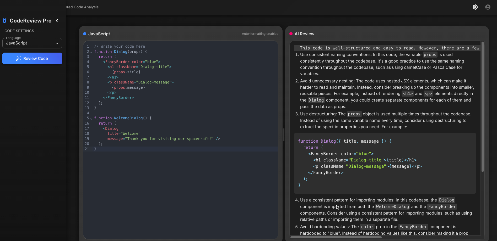

# CodeReview Pro

> "Code reviews: because sometimes 'it works on my machine' isn't good enough."




**CodeReview Pro** is an AI-powered code analysis tool that helps you write better code by providing instant feedback on quality, performance, and best practices. Think of it as having a senior developer looking over your shoulder, but without the awkward silence or coffee breath.

## ✨ Features

- **Real-time AI Analysis** - Get instant feedback on your code without waiting for human reviewers
- **Multi-language Support** - Works with JavaScript, TypeScript, Python, Java, C#, and more!
- **Resizable Interface** - Drag to adjust the editor and review panels to your liking
- **Dark/Light Modes** - Because we care about your retinas at 2 AM
- **Local & Cloud Options** - Run locally with Ollama or in production with OpenAI

## 🎬 Demo

Check out CodeReview Pro in action:

[![CodeReview Pro Demo]](https://github.com/user-attachments/assets/1519ba18-c955-4fc7-9771-3c886b6811db)


## 🛠️ Tech Stack

- **Frontend**: Next.js, React, Material UI
- **AI Integration**: Ollama (local development), OpenAI (production)
- **Code Editor**: CodeMirror with syntax highlighting
- **Markdown**: React Markdown for review rendering

## 🚦 Getting Started

### Prerequisites

- Node.js 18+ and pnpm/npm/yarn
- For local AI: [Ollama](https://ollama.ai) with CodeLlama model

### Installation

1. Clone this repository:

```bash
git clone https://github.com/yourusername/codereview-pro.git
cd codereview-pro
```

2. Install dependencies:

```bash
pnpm install 
# or
npm install
# or
yarn install
```

3. Set up environment variables (see [Environment Setup](#-environment-setup))

4. Start the development server:

```bash
pnpm run dev
# or
npm run dev
# or
yarn dev
```

5. Open [http://localhost:3000](http://localhost:3000) and start reviewing some code!

## 🔐 Environment Setup

Create a `.env.local` file in the project root:

```plaintext
# For local development with Ollama
OLLAMA_MODEL=codellama
OLLAMA_URL=http://localhost:11434

# For production with OpenAI (optional)
OPENAI_API_KEY=your_openai_api_key
```

### 🚨 IMPORTANT: Protecting Your API Keys

To avoid accidentally pushing your API keys to GitHub:

1. **Add `.env.local` to your `.gitignore` file**:

```plaintext
# .gitignore
.env.local
.env.*.local
```

2. **Use environment variables in production**:
   - When deploying to Vercel, add your environment variables in the Vercel dashboard
   - For other platforms, consult their documentation on secure environment variable storage

3. **Consider using a secrets manager** for team projects

## 🧠 Using Ollama Locally

1. Install Ollama from [ollama.ai](https://ollama.ai)
2. Pull the CodeLlama model:

```bash
ollama pull codellama
```

3. Start Ollama:

```bash
ollama serve
```

4. That's it! The app will automatically connect to your local Ollama instance.

## 🚀 Deployment

### Deploying to Vercel

1. Push your code to GitHub (without API keys!)
2. Connect your repository to Vercel
3. Add environment variables in the Vercel dashboard
4. Deploy!

[](https://vercel.com/new/clone?repository-url=https%3A%2F%2Fgithub.com%2Fyourusername%2Fcodereview-pro)

## 🎮 Usage Tips

- **Try the Fibonacci example** for a quick demo of the code review capabilities
- **Resize the panels** by dragging the divider between editor and review
- **Dark mode** is available via the toggle in the header

## 🤝 Contributing

Found a bug? Have a cool idea? Want to make this even better? Contributions are welcome!

1. Fork the repository
2. Create your feature branch (`git checkout -b feature/amazing-feature`)
3. Commit your changes (`git commit -m 'Add some amazing feature'`)
4. Push to the branch (`git push origin feature/amazing-feature`)
5. Open a Pull Request


## 🙏 Acknowledgments

- CodeLlama and OpenAI for the AI magic
- The Next.js and Material UI teams for the awesome frameworks
- Coffee, for making this all possible

---

Made with ❤️ and probably too much caffeine

[LinkedIn](https://www.linkedin.com/in/mandeep-singh-23b964122/) • 
[Github](https://github.com/mandeepsingh110696) • 
[Portfolio](https://mandeepsinghdev.com/)
